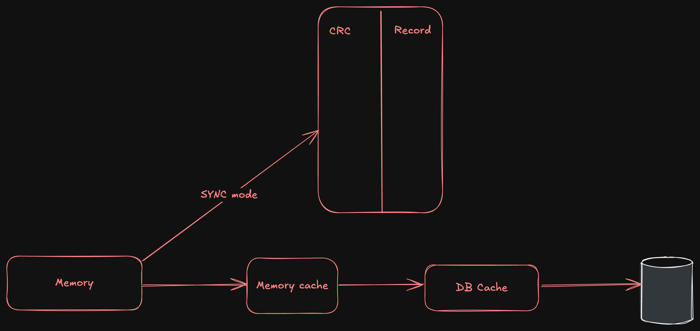
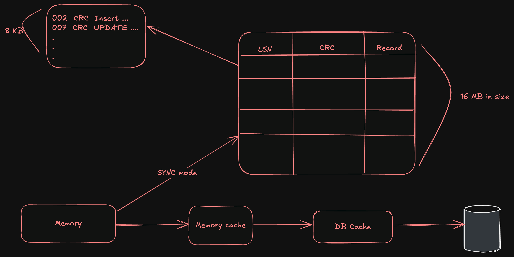

# How do Database ensure Atomacity

Freom the very first day of database, the concept of **Atomicity** has been a cornerstone of database transactions. But what does it really mean, and how do databases ensure that operations are atomic? In this article, we’ll explore the concept of atomicity in databases, how it’s implemented, and why it’s crucial for maintaining data integrity. We have been learning about databases for ages and whenever we talk about Database one thing we tends to remember is the ACID property.
So, Atomacity is the first property of ACID. Let's know what eaxctly is Atomacity.

## What is Atomacity?
`An atomic transaction is an indivisible and irreducible series of database operations such that either all occur, or none occur.` (To, 2003)
In general terms, atomicity means that a transaction is treated as a single unit of work. This means that either all operations within the transaction are successfully completed, or none of them are applied to the database. If any part of the transaction fails, the entire transaction is rolled back, leaving the database in its previous state.
This ensures that the database remains consistent and prevents partial updates that could lead to data corruption or inconsistency.
It do surely sounds like magic right? transaction are treated as one and either all operations are applied or none at all. This is not magic just a clever design in database systems that ensures data integrity and consistency.
So are you feeling interested in how this is implemented in databases? Let's explore the mechanisms that ensure atomicity.
Before we jump into exact implementation of atomacity let's understand the concept of **transactions** in databases and what will happen if we do commit in a DB (In case where we don't have atomacity).

## What will happen if we do commit in DB.
As I have mentioned in my previous bolg, DB can be seen as a simple file block and these blocks are stored in memory in a block and we have to do anything to a data in a block we have to first read the block from memory, make changes to it and then write it back to the DB. This is how we do commit in DB.
Let's understand it with an image

In the above image, we can see that we have a block in memory and we are making changes to it. After making changes we are writing it to Memory cache then to DB cache and finally to the DB. This is how we do commit in DB.
However, if we don't have atomicity in place, what happens if something goes wrong during this process? Let's say we are updating a block and the system crashes after writing to the memory cache but before writing to the DB cache. In this case, the changes made to the memory cache will not be reflected in the DB, leading to an inconsistent state.

This is where atomicity comes into play. It ensures that either all changes are applied to the database or none at all, preventing such inconsistencies.
## How do Databases Ensure Atomicity?
Databases implement atomicity through various mechanisms, but one of the most well known method is **Write-Ahead Logging (WAL)**. WAL is a technique that ensures that all changes made to the database are logged before they are applied. This log acts as a record of all operations, allowing the database to recover to a consistent state in case of a failure.

So, when using WAL, whenever we got a commit request, the database first writes the changes to a log file before applying them to the actual database. This log file is stored in a durable storage medium, ensuring that even if the system crashes, the changes can be recovered from the log. The writting in the log file is done very quickly as it will be opened in sync mode and then the changes can be pushed to the DB periodically or in a batch process.
This way, if a transaction fails or the system crashes, the database can use the log to roll back any changes that were not fully applied, ensuring that the database remains in a consistent state.

So, let's dive deep into the journal or the log file that we will be using in WAL. The log file is a sequential record of all changes made to the database and is only appended. Each entry in the log file contains information about the operation performed, such as the type of operation (insert, update, delete), the data affected, and a timestamp. This allows the database to reconstruct the state of the database at any point in time.

Each record in the log is protected by CRC-32(cyclic redudency check) checksum to ensure data integrity. This means that if the log file is corrupted, the database can detect the corruption and take appropriate action, such as rolling back the transaction or restoring from a backup. What is CRC-32? to understand it simple it's like storing the exact length of the transaction that have been performed before writing this transaction to the log file. This way, if the system crash while writing log or only some part of log is written to the log file, the DB will throw an error or discard this record.

WAL file can be a single file or multiple file, which is usually of 16MB in size with say 8KB of page size( this can change according to DB as we have selected 4KB in previous blog for Sqlite DB but modern DB like postgres will use 8KB). The WAL file is written in a sequential manner, meaning that new entries are always added to the end of the file. This allows for efficient writing and reading of the log file, as the database can quickly append new entries without having to search for a specific location in the file and the point to which we have already read is stored in some other place. In each page we have another field that is called as log sequence number(can be seen as an ID number for this row). The genius of design used here is the log sequence number isn't something like integer or string, it is a combination of the file number and the offset within the file. This means that each entry in the log file has a unique identifier that can be used to quickly locate it in the file. This allows for efficient recovery of the database in case of a failure, as the database can quickly find the last committed transaction and roll back any uncommitted changes.

## Conclusion
In conclusion, atomicity is a fundamental property of database transactions that ensures data integrity and consistency. It guarantees that a transaction is treated as a single unit of work, where either all operations are successfully completed or none are applied to the database. This is achieved through mechanisms like Write-Ahead Logging (WAL), which logs all changes before they are applied, allowing for recovery in case of failures.
Atomicity is crucial for maintaining the reliability of databases, especially in systems where multiple transactions can occur simultaneously. By ensuring that transactions are atomic, databases can prevent partial updates and maintain a consistent state, even in the face of failures or crashes.

## Refrence
to, C 2003, that a transaction is either completed completely or not at all, Wikipedia.org, Wikimedia Foundation, Inc., viewed 21 August 2025, <https://en.wikipedia.org/wiki/Atomicity_(database_systems)>.

2025, Youtube.com, viewed 21 August 2025, <https://www.youtube.com/watch?v=wI4hKwl1Cn4>.

‌
‌